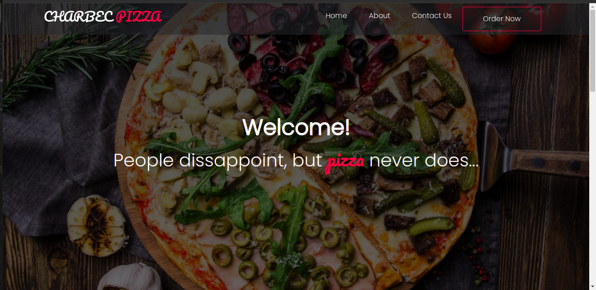

# Charbec Pizza
#### By Charles Okunzo
### This is a website for an online pizza delivery services.

## Table of Contents
+ [Description](#description)
+ [Installation Requirements](#installation)
+ [Live link](#link)
+ [Technologies Used](#technology)
+ [Known Bugs](#bugs)
+ [Lisence](#lisence)
+ [Authors Info](#author)

## Description

This is an application for an online pizza delivery company where users can order their prefered pizza and it be delivered to them or they can collect it by themselves.

## Installation 
### Requirements

* Either a computer,phone,tablet or an Ipad
* An access to the Internet
### Installation
* Clone the github repo
* Open the clone in a text editor and host it on your browser

[Go Back to the top](#portfolio)

## Live link
[Follow This Link](https://charles-okunzo.github.io/charbec-pizza)

## Technology Used
* HTML- to build the structure of the page
* CSS- to style the the pages
* Javascript- to enable interractivity with the page.
* jQuery
* Bootstrap

[Go Back to the top](#portfolio)

## Known Bugs
* No know bugs. In case your discover any, please contact the admin.

## Licence

Copyright (c) 2022 MIT License. [View License Here](LICENSE)

[Go Back to the top](#portfolio)

## Authors Info

* Slack Profile - [Charles Okunzo](https://app.slack.com/client/T0101L740P4/C010GLANY3A/user_profile/U02TTFQ0VJR)
* Email address - [charles.okunzo@student.moringaschool.com](mailto:charles.okunzo@student.moringaschool.com)

